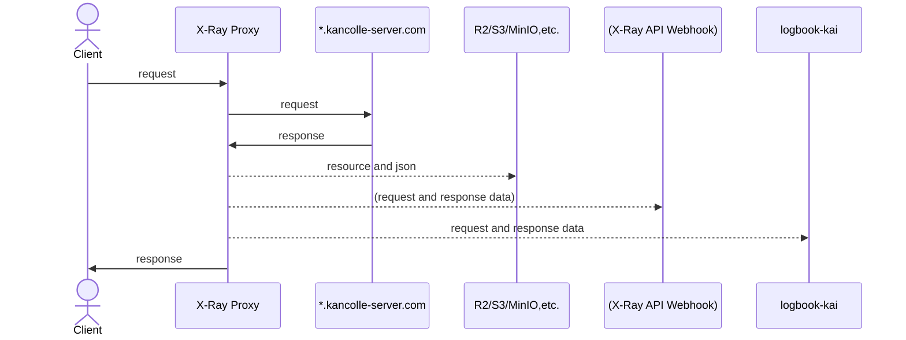

# 航海日誌 (logbook-kai) と組み合わせて使う

X-Ray Proxyは[@rskyが個人的にメンテナンスしている、パッシブモードが実装されたバージョンの航海日誌 (logbook-kai)](https://github.com/rsky/logbook-kai)と組み合わせて使えるようにデザインされています。

というか、開発中のX-Ray Webが使い物になるまでは航海日誌と併用せざるを得ない事情もあり。。。

mitmproxyが提供するルート認証局のSSL/TLS証明書を信頼することで、HTTP移行した艦これAPIに対応します。

## コンセプト

プロキシサーバとしての機能はX-Ray Proxyが担い、航海日誌が必要なレスポンスはX-Ray Proxyが航海日誌にHTTP POSTで転送します。



## X-Ray Proxyの設定

[設定ファイル](./config/index.md)の `[logbook_kai]` セクションで `enabled = true` にしてX-Ray Proxyを起動するとlogbook-kaiとの連携が有効になります。

```toml
[logbook_kai]
# logbook-kaiとの連携を有効にする。default: false
enabled = true
# logbook-kaiのホスト名またはIPアドレス。default: "127.0.0.1"
host = "127.0.0.1"
# logbook-kaiのポート番号。default: 8888
port = 8888
```
